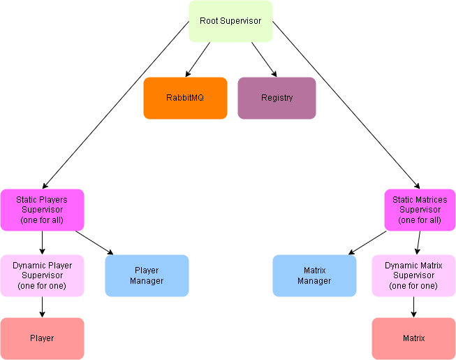
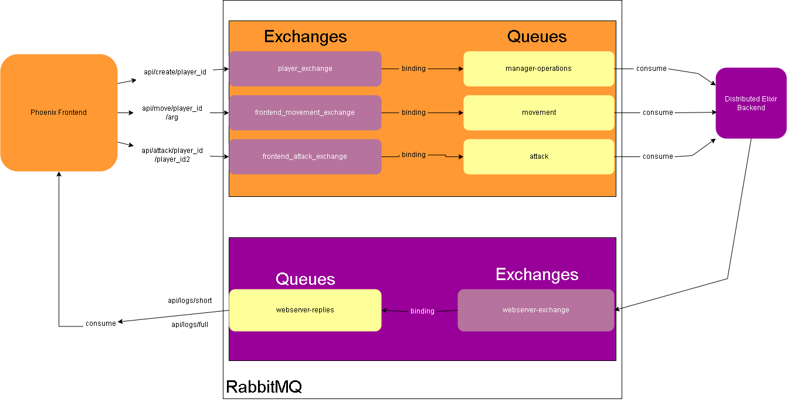

# Ilias & Lobke's MMO-Map

  - [How To Play](#how-to-play)
  - [Installation](#installation)
    - [Backend](#backend)
    - [Frontend](#frontend)
  - [Site Access](#site-access)
  - [API](#api)
    - [Frontend](#frontend-1)
    - [Backend](#backend-1)
  - [Chat system](#chat-system)
  - [Sketches](#sketches)

## How To Play
We created an MMO map that is a 40x40 grid made out of 1600 tiles. The border tiles are mountains so these are not accessible. 
When a player enters the map, it spawns at tile (39,39). The player's HP is 100 at the start of the game.
A player can move north, east, south or west on the map. It can only move 1 tile at a time. 
A player can attack an adjacant player. The other player has to be in a radius of 1 tile in order for it to be hit. When two players are standing on the same tile, they can't hit each other. 
When a player is hit, it loses 10HP. If the player has no HP left after that, it respawns at start with 100HP.

## Installation
### Backend
To access the backend, do:
```
cd backendmmo/
mix deps.get
iex -S mix
```

### Frontend
To access the frontend, do:
```
cd frontendmmo/
mix deps.get
iex -S mix phx.server
```

## Site Access
When both frontend and backend are turned on, you can go to localhost:4000 to start playing.
You need to enter a username and you will be redirected to the game. Here you can move the player around on the board and attack other players. 

## API 
### Frontend
You can also move/attack with your player through API call requests.

To create a player:
```
localhost:4000/api/create/<username>
```

To move a player:
```
localhost:4000/api/move/<username>/N  (north)
localhost:4000/api/move/<username>/E  (east)
localhost:4000/api/move/<username>/S  (south)
localhost:4000/api/move/<username>/W  (west)
```

To attack a differen player:
```
localhost:4000/api/attack/<username>/<attacked-username>
```
If you want to see a log of everything that happens in the game:
```
localhost:4000/api/logs/full
```
If you want to see a log of the last 10 logs:
```
localhost:4000/api/logs/short
```
### Backend
If you want to use the backend terminal then you can use the following commands:

```
Mmo.Player.walk("player", :N)  
Mmo.Player.walk("player", :E)  
Mmo.Player.walk("player", :S)  
Mmo.Player.walk("player", :W)  
Mmo.Player.attack("player", "attacked-player")
```

If you want to see the location of a player use: 
```
Mmo.Player.get_position("player")
Mmo.Player.get("player)
```

## Chat system
If a player wants to enter the chat, simply go to:
```
localhost:4000/<username>/chat
```

## Sketches
### OTP


### Distributed

